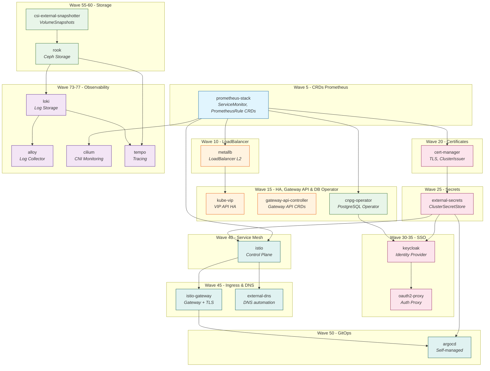

# Infrastructure Kubernetes avec ArgoCD

Infrastructure complète Kubernetes déployée via ArgoCD avec le pattern **App of Apps** et **ApplicationSets**.

## Architecture

```
deploy-applicationsets.sh (Liste hardcodée)
    ↓
apps/ (Applications modulaires - 10 ApplicationSets)
    ├── metallb/
    │   ├── applicationset.yaml         # Wave 10
    │   ├── config/
    │   │   ├── dev.yaml
    │   │   └── prod.yaml
    │   └── resources/
    │       └── ipaddresspool.yaml
    ├── kube-vip/
    │   ├── applicationset.yaml         # Wave 15
    │   └── config/
    │       ├── dev.yaml
    │       └── prod.yaml
    ├── gateway-api-controller/
    │   ├── applicationset.yaml         # Wave 15
    │   └── config/
    │       ├── dev.yaml
    │       └── prod.yaml
    ├── cert-manager/
    │   ├── applicationset.yaml         # Wave 20
    │   ├── config/
    │   │   ├── dev.yaml
    │   │   └── prod.yaml
    │   └── resources/
    │       └── clusterissuer-*.yaml
    ├── external-dns/
    │   ├── applicationset.yaml         # Wave 30
    │   └── config/
    │       ├── dev.yaml
    │       └── prod.yaml
    ├── ingress-nginx/
    │   ├── applicationset.yaml         # Wave 40
    │   └── config/
    │       ├── dev.yaml
    │       └── prod.yaml
    ├── argocd/
    │   ├── applicationset.yaml         # Wave 50
    │   └── config/
    │       ├── dev.yaml
    │       └── prod.yaml
    ├── csi-external-snapshotter/
    │   ├── applicationset.yaml         # Wave 55
    │   └── config/
    │       ├── dev.yaml
    │       └── prod.yaml
    ├── longhorn/
    │   ├── applicationset.yaml         # Wave 60
    │   └── config/
    │       ├── dev.yaml
    │       └── prod.yaml
    └── prometheus-stack/
        ├── applicationset.yaml         # Wave 75
        └── config/
            ├── dev.yaml
            └── prod.yaml
    ↓
config/config.yaml (Configuration de base)
    ↓
Applications déployées (10 Applications)
    ├── metallb
    ├── kube-vip
    ├── gateway-api-controller
    ├── cert-manager
    ├── external-dns
    ├── ingress-nginx
    ├── argocd
    ├── csi-external-snapshotter
    ├── longhorn
    └── prometheus-stack
```

## Ordre de déploiement (Sync Waves)

Les applications sont déployées dans cet ordre via les **sync waves** (définis dans chaque `applicationset.yaml`) :

| Wave | Application | Description |
|------|-------------|-------------|
| 5 | `prometheus-stack` | CRDs Prometheus (ServiceMonitor, PrometheusRule) |
| 10 | `metallb` | Load Balancer Layer 2 |
| 15 | `kube-vip` | VIP pour l'API Kubernetes HA |
| 15 | `gateway-api-controller` | Gateway API CRDs |
| 15 | `cnpg-operator` | CloudNativePG (PostgreSQL Operator) |
| 20 | `cert-manager` | Gestion des certificats TLS |
| 25 | `external-secrets` | External Secrets Operator |
| 30 | `keycloak` | Identity Provider (SSO) |
| 35 | `oauth2-proxy` | OAuth2 Proxy pour Istio |
| 40 | `istio` | Service Mesh (control plane) |
| 45 | `external-dns` | Synchronisation DNS automatique |
| 45 | `istio-gateway` | Gateway Istio + TLS |
| 50 | `argocd` | GitOps Controller (self-managed) |
| 55 | `csi-external-snapshotter` | CSI Snapshot Controller |
| 60 | `rook` / `longhorn` | Stockage distribué (Ceph/Longhorn) |
| 73 | `loki` | Stockage des logs |
| 74 | `alloy` | Collecteur de logs |
| 76 | `cilium` | Monitoring CNI (Hubble) |
| 77 | `tempo` | Distributed Tracing |

### Graphe de dépendances



### Légende des dépendances

| Application | Dépend de | Raison |
|-------------|-----------|--------|
| `prometheus-stack` | ∅ | Fournit les CRDs (ServiceMonitor, PrometheusRule) |
| `metallb` | prometheus-stack | ServiceMonitors pour métriques |
| `kube-vip` | metallb | Utilise LoadBalancer pour VIP |
| `cnpg-operator` | prometheus-stack | ServiceMonitors pour métriques |
| `cert-manager` | prometheus-stack | ServiceMonitors pour métriques |
| `external-secrets` | cert-manager | CA pour ClusterSecretStore |
| `keycloak` | cnpg-operator, external-secrets | DB operator + secrets |
| `oauth2-proxy` | keycloak | OIDC provider |
| `istio` | cert-manager, external-secrets | TLS + secrets OIDC |
| `istio-gateway` | istio, cert-manager | Gateway + certificats TLS |
| `argocd` | istio-gateway, external-secrets | Ingress + secrets OIDC |
| `rook` | csi-external-snapshotter, external-secrets | Snapshots + CA pour dashboard |
| `loki` | rook | StorageClass pour logs |
| `alloy` | loki | Endpoint Loki pour envoi logs |
| `tempo` | rook, loki | Storage + corrélation logs-traces |
| `cilium` | prometheus-stack | ServiceMonitors pour Hubble |

## Déploiement initial

### 1. Prérequis

- Cluster Kubernetes fonctionnel
- ArgoCD installé dans le namespace `argo-cd`
- Accès `kubectl` au cluster
- Git repo cloné localement (https://github.com/gigi206/k8s)

### 2. Déploiement des ApplicationSets

```bash
# Déployer tous les ApplicationSets (liste hardcodée dans le script)
cd deploy/argocd
./deploy-applicationsets.sh

# Vérifier que les ApplicationSets sont créés
kubectl get applicationset -n argo-cd

# Attendre que les Applications soient générées
kubectl get application -A

# Suivre le déploiement (respecte les sync waves)
kubectl get application -A -w
```

### 3. Configuration post-déploiement

#### MetalLB - Pool d'IPs

Adapter les IPs dans `apps/metallb/ipaddresspool.yaml` selon votre réseau :

```bash
kubectl apply -f deploy/argocd/apps/metallb/ipaddresspool.yaml
```

#### Cert-Manager - ClusterIssuers

Appliquer les émetteurs de certificats :

```bash
kubectl apply -f deploy/argocd/apps/cert-manager/clusterissuer-selfsigned.yaml
# Ou pour Let's Encrypt (après avoir modifié l'email)
kubectl apply -f deploy/argocd/apps/cert-manager/clusterissuer-letsencrypt.yaml.disabled
```

**Note** : Modifier les emails dans `clusterissuer.yaml` avant de les appliquer.

## Configuration

### Structure de configuration

```
config/
└── config.yaml              # Configuration de base

apps/
├── metallb/
│   ├── config/
│   │   ├── dev.yaml         # Config MetalLB dev
│   │   └── prod.yaml        # Config MetalLB prod
│   └── resources/
│       └── ipaddresspool.yaml
│
├── cert-manager/
│   ├── config/
│   │   ├── dev.yaml         # Config Cert-Manager dev
│   │   └── prod.yaml        # Config Cert-Manager prod
│   └── resources/
│       └── clusterissuer.yaml
│
└── ...et ainsi de suite pour chaque application
```

### Basculer d'environnement

**Chaque ApplicationSet utilise le Merge Generator** qui combine :
1. `config/config.yaml` (configuration de base)
2. `apps/{app}/config/*.yaml` (config spécifique par app et environnement)

Pour basculer d'environnement, éditer `config/config.yaml` :

```bash
# config/config.yaml
environment: dev    # Changer à "prod" pour basculer en production

# Commit et push
git add config/config.yaml
git commit -m "Switch to prod environment"
git push
```

Le Merge Generator fusionnera automatiquement `config.yaml` avec le fichier `apps/{app}/config/prod.yaml` de chaque application (mergeKeys: [environment]).

### Modification de la configuration

Pour modifier un paramètre :

1. Éditer le fichier de configuration approprié :
   - **Paramètres communs** (domain, feature flags) → `config/config.yaml`
   - **Paramètres spécifiques** à une app (incluant la version) → `apps/{app}/config/dev.yaml` ou `apps/{app}/config/prod.yaml`
2. Commit et push vers Git
3. ArgoCD synchronise automatiquement

Exemple - Changer le nombre de replicas d'Ingress en dev :

```yaml
# apps/ingress-nginx/config/dev.yaml
environment: dev
appName: ingress-nginx

ingressNginx:
  controller:
    replicaCount: 3  # Modifier ici
```

### Feature flags

Activer/désactiver des composants via `features` :

```yaml
features:
  metallb:
    enabled: true
  certManager:
    enabled: true
  externalDns:
    enabled: false  # Désactiver External-DNS en dev
  ingress:
    enabled: true
    class: "nginx"
  storage:
    enabled: true
    class: "longhorn"
  monitoring:
    enabled: true
```

## Environnements

### Dev (development)

- **Auto-sync** : Activé
- **Replicas** : 1
- **Resources** : Minimales
- **DNS externe** : Désactivé
- **Certificats** : Auto-signés

### Prod (production)

- **Auto-sync** : Désactivé (sync manuel)
- **Replicas** : 3+
- **Resources** : Production
- **DNS externe** : Activé
- **Certificats** : Let's Encrypt production

## Accès aux services

### ArgoCD UI

```bash
# Via Ingress (si configuré)
# https://argocd.dev.example.local (dev)
# https://argocd.prod.example.local (prod)

# Via Port-forward
kubectl port-forward -n argo-cd svc/argocd-server 8080:443

# Accès : https://localhost:8080

# Credentials
User: admin
Password: kubectl -n argo-cd get secret argocd-initial-admin-secret \
  -o jsonpath='{.data.password}' | base64 -d
```

### Grafana (Monitoring)

```bash
# Port-forward
kubectl port-forward -n monitoring svc/prometheus-stack-grafana 3000:80

# Credentials
User: admin
Password: admin (dev) ou configuré dans config
```

### Longhorn UI (Storage)

```bash
# Port-forward
kubectl port-forward -n longhorn-system svc/longhorn-frontend 8080:80

# Accès : http://localhost:8080
```

### Prometheus

```bash
# Port-forward
kubectl port-forward -n monitoring svc/prometheus-stack-kube-prom-prometheus 9090:9090

# Accès : http://localhost:9090
```

## Commandes utiles

```bash
# Lister tous les ApplicationSets
kubectl get applicationset -n argo-cd

# Lister toutes les Applications générées
kubectl get application -A

# Voir le statut d'une Application
kubectl get application -n argo-cd metallb-dev -o yaml

# Forcer la synchronisation
kubectl patch application metallb-dev -n argo-cd \
  --type merge -p '{"operation":{"initiatedBy":{"username":"admin"}}}'

# Voir les logs ArgoCD ApplicationSet Controller
kubectl logs -n argo-cd -l app.kubernetes.io/name=argocd-applicationset-controller

# Voir les sync waves
kubectl get application -A -o jsonpath='{range .items[*]}{.metadata.name}{"\t"}{.metadata.annotations.argocd\.argoproj\.io/sync-wave}{"\n"}{end}' | sort -k2 -n
```

## Troubleshooting

### Applications OutOfSync

```bash
# Vérifier la configuration Git
kubectl get applicationset metallb -n argo-cd -o jsonpath='{.spec.generators[0].git}'

# Vérifier les erreurs de génération
kubectl describe applicationset metallb -n argo-cd

# Forcer un refresh
kubectl patch applicationset metallb -n argo-cd \
  --type merge -p '{"metadata":{"annotations":{"argocd.argoproj.io/refresh":"normal"}}}'
```

### Sync Waves ne respectent pas l'ordre

Vérifier les annotations `argocd.argoproj.io/sync-wave` :

```bash
kubectl get application -A -o yaml | grep -A 1 "sync-wave"
```

### MetalLB ne fournit pas d'IPs

```bash
# Vérifier que les IPAddressPool sont créés
kubectl get ipaddresspool -n metallb-system

# Vérifier les logs MetalLB
kubectl logs -n metallb-system -l app.kubernetes.io/component=controller
```

## Repos Helm utilisés

- **MetalLB** : https://metallb.github.io/metallb
- **Cert-Manager** : https://charts.jetstack.io
- **External-DNS** : https://kubernetes-sigs.github.io/external-dns
- **Ingress-NGINX** : https://kubernetes.github.io/ingress-nginx
- **ArgoCD** : https://argoproj.github.io/argo-helm
- **Longhorn** : https://charts.longhorn.io
- **Prometheus-Stack** : https://prometheus-community.github.io/helm-charts

## Architecture Modulaire

### Principe : Applications Self-Contained

Chaque application est **complètement autonome** dans son propre dossier :

```
apps/
└── metallb/
    ├── applicationset.yaml    # Définition de l'ApplicationSet
    ├── config/
    │   ├── dev.yaml           # Configuration dev
    │   └── prod.yaml          # Configuration prod
    └── resources/
        └── ipaddresspool.yaml # Ressources Kubernetes supplémentaires
```

**Avantages** :
- ✅ **Modularité** : Copier le dossier = copier l'application complète
- ✅ **Réutilisabilité** : Facile de réutiliser dans un autre projet
- ✅ **Clarté** : Tout ce qui concerne une app est au même endroit
- ✅ **Organisation** : Toutes les apps regroupées dans `apps/`
- ✅ **Déploiement contrôlé** : Liste explicite dans `deploy-applicationsets.sh`

### Fonctionnement des ApplicationSets

Chaque ApplicationSet :

- Utilise le **Merge Generator** pour fusionner :
  - `config/config.yaml` (base + sélecteur environment)
  - `apps/{app}/config-*.yaml` (config spécifique par app)
- Génère **1 Application** (selon environment dans config.yaml)
- Déploie un **chart Helm officiel** + ressources custom (via `sources`)
- Utilise **Go templating** avec `templatePatch` pour les conditionnels
- Respecte les **sync waves** pour l'ordre de déploiement

## Modification de l'infrastructure

### Ajouter une nouvelle application

1. Créer un nouveau dossier dans `apps/` : `apps/my-app/`
2. Créer les fichiers nécessaires :
   - `apps/my-app/applicationset.yaml` (ApplicationSet avec sync wave)
   - `apps/my-app/config/dev.yaml` (configuration dev)
   - `apps/my-app/config/prod.yaml` (configuration prod)
   - Ressources Kubernetes supplémentaires si nécessaire
3. Ajouter l'application dans `deploy-applicationsets.sh` (ligne ~267) :
   ```bash
   APPLICATIONSETS=(
     # ... apps existantes
     "apps/my-app/applicationset.yaml"              # Wave XX
   )
   ```
4. Commit et push

**Alternative** : Déploiement manuel sans modifier le script :
```bash
kubectl apply -f apps/my-app/applicationset.yaml
```

### Désactiver une application

**Option 1** : Retirer de la liste dans `deploy-applicationsets.sh` :
```bash
# Commenter ou supprimer la ligne dans deploy-applicationsets.sh (ligne ~267)
APPLICATIONSETS=(
  # "apps/prometheus-stack/applicationset.yaml"   # Wave 75 - Désactivé
)
```

**Option 2** : Supprimer l'ApplicationSet déjà déployé :
```bash
kubectl delete applicationset prometheus-stack -n argo-cd
```

## Fonctionnement du Merge Generator

Le **Merge Generator** fusionne plusieurs sources de configuration en utilisant une clé commune (`mergeKeys: [environment]`).

### Exemple de fusion

Avec `environment: dev` dans `config/config.yaml` :

```yaml
# config/config.yaml
environment: dev
common:
  domain: "example.local"
features:
  metallb:
    enabled: true
```

```yaml
# apps/metallb/config/dev.yaml
environment: dev
appName: metallb

metallb:
  version: "0.15.3"  # Version du chart Helm (gérée par Renovate)
  ipAddressPool:
    - name: default
      addresses:
        - 192.168.1.220-192.168.1.250
```

**Résultat de la fusion** :
```yaml
environment: dev
common:
  domain: "example.local"
features:
  metallb:
    enabled: true
metallb:
  version: "0.15.3"
  ipAddressPool:
    - name: default
      addresses:
        - 192.168.1.220-192.168.1.250
```

**Note** : Les versions des charts Helm sont désormais définies dans chaque fichier de configuration d'application (`apps/{app}/config/*.yaml`), ce qui permet à Renovate de les mettre à jour automatiquement.

Le Merge Generator ne fusionnera que les fichiers ayant la même valeur de `environment`.

## Ressources

- [ArgoCD ApplicationSet](https://argo-cd.readthedocs.io/en/stable/user-guide/application-set/)
- [ArgoCD Merge Generator](https://argo-cd.readthedocs.io/en/stable/operator-manual/applicationset/Generators-Merge/)
- [ArgoCD Sync Waves](https://argo-cd.readthedocs.io/en/stable/user-guide/sync-waves/)
- [Go Templating](https://argo-cd.readthedocs.io/en/stable/operator-manual/applicationset/GoTemplate/)
